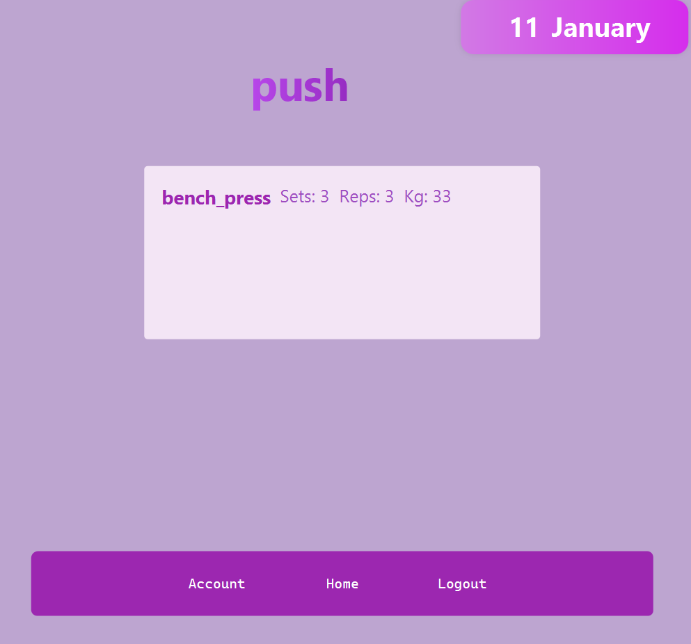

# Gym App - Project in Java

## Introduction
This project presents the structure of an app designed for gym-goers. It is built in Java using JavaFX, integrating CSS for an enhanced frontend experience. The primary focus is to offer a user-friendly interface and robust functionality for those who regularly visit the gym.

## Short Description
The Gym App is tailored for individuals who frequent the gym and wish to monitor their workouts meticulously. It allows users to track their exercise routines, monitor progress, and keep records of their best performances. Its intuitive design and comprehensive tracking system make it an indispensable tool for fitness enthusiasts.

## App Logic
- **Data Base:** Stores the entire data of the app (users, workouts, etc.).
- **Calendar:** Displays a calendar and shows on which days the user had a workout.
- **Account:** Allows users to view their records.

## Classes and Description
### Main Application
- **Application:** The primary class that launches the JavaFX application.

### Users
- **Admin:** Controls the app and can see every user's activity.
- **Normal User:** Inserts their workout and views their records.

### Utilities
- **Enumeration - SCENE_IDENTIFIER:** An enumeration containing each scene title.
- **Scene Controller and ApplicationHandler:** Classes that manage transitions between scenes and load the FXML files.
- **Shared-data:** A class storing various variables needed throughout the application (e.g., user's username and id).
- **PostgreSQL:** A class for connecting to the PostgreSQL local server, containing static methods for various queries.
- **Encrypt:** A class for encrypting passwords before storing them in the database.
- **EmailSender:** Manages the sending of passwords to the user's email.

### Controllers
- **SignUpController:** The scene where the user can create an account.
- **LogInController:** The scene where the user can log in.
- **ForgotPassword:** The scene where the user can receive their password via email from the database.
- **CalendarView:** The home page, displaying a calendar where the user can see on which days they had a workout and choose a date to insert a new workout.
- **InsertWorkout:** The scene where the user inserts a workout that gets stored in the database.
- **AccountPage:** Here the user sees their personal records for each exercise.
- **AdminPage:** Accessible only by the admin, where they can view every user's activity.

## Class Diagram
The following diagram shows the structure of the Gym App and the relation between each class.

## Screensohts
Here are some screenshots with the app.

This is the Home-Page where the user sees when he had an workout and also he can add another one.

Here, if the user had a workout, he can see what he had and if didn't have any, he can insert another one.

And finally this is the account page where the user can see his personal records.

## Database

The Gym App utilizes a local PostgreSQL server as its database solution. This database is structured into four main tables: `users`, `typeofworkout`, `exercises`, and `userworkout`. These tables are intricately linked to each other, allowing for efficient storage and retrieval of data related to user activities, workout types, specific exercises, and user workout records. This relational database design ensures that all necessary data is stored in an organized and accessible manner.

To facilitate the connection between the Java application and the PostgreSQL database, a specific JDBC (Java Database Connectivity) library was employed. This library provides the necessary tools to establish a connection to the database, execute queries, and handle the data within the Java application.

Below is a diagram of how the tables are structured and connected: 

## Important mentions
-For sending the password via email i've used a thid-party SMTP server by GMAIL. This requires proper internet connection. It may have a delay until you receive the email with the password and if you don't receive it, you need to check your spam inbox as well.

## Conclusion
The Gym App is a comprehensive solution for gym enthusiasts to track and manage their workout routines efficiently, having a simple and user-friendly interface. Various functionalities can be added in the future, making the app a good contender in the marketplace.

